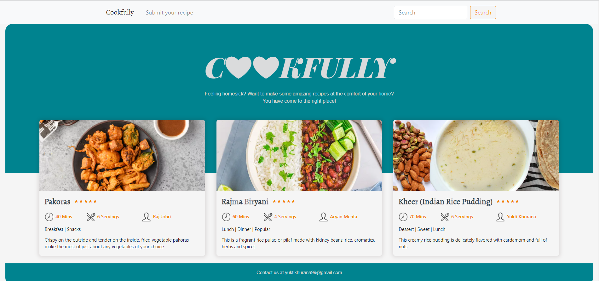
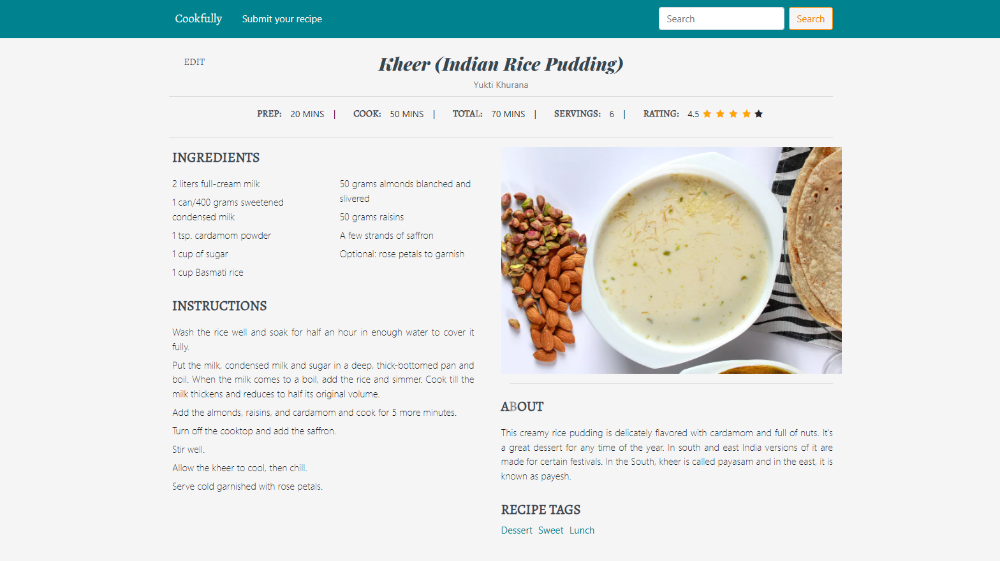

# Indian Recipes CRUD Application
A CRUD application that allows you to explore, add, edit, and search various Indian cuisine delicacies

Youtube Link: https://www.youtube.com/watch?v=BODavEUr5dw

### Steps to Run
  #### Install virtualenv
  `py -2 -m pip install virtualenv`

  #### Create Environment
  `mkdir <project name>`
  `cd <project name>`

  #### Activate Environment
  `<name of environment>\Scripts\activate`

  #### Install Flask
  `pip install Flask`
  
  #### Set FLASK_APP environment variable.
  `setx FLASK_APP "server.py"`

  #### Run the application
  `flask run`  
  or  
  `python server.py `

### References
This site is created for educational purposes as a course project. 
Reference for the recipes and images used as graphics:  
https://www.thespruceeats.com/easy-and-quick-indian-recipes-4118365
